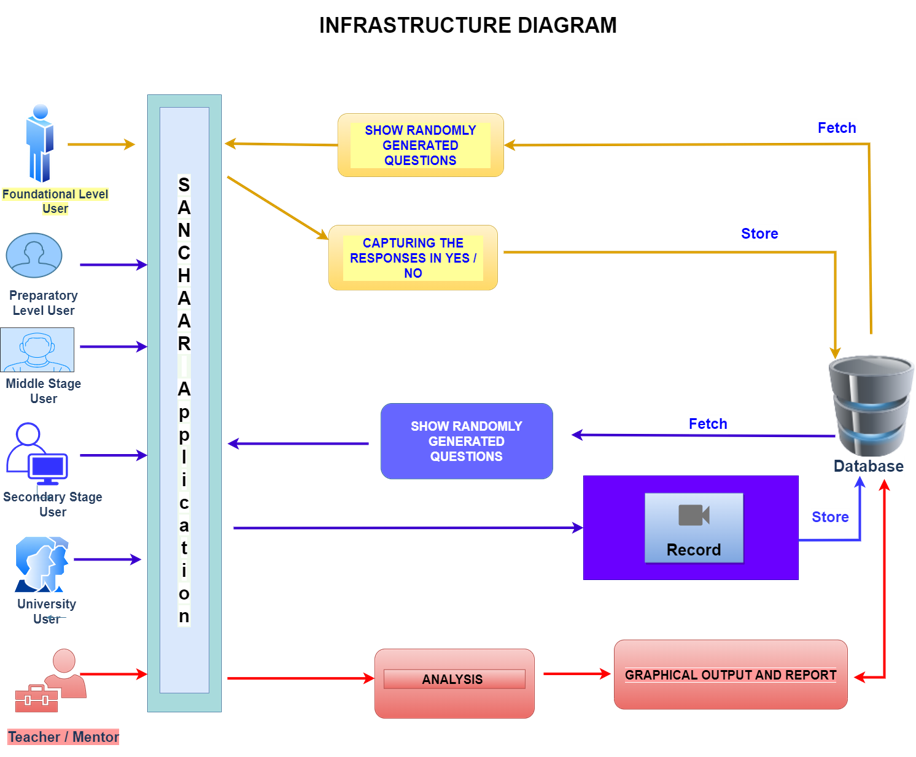

# Sanchaar - Test your presentation skills

This project was presented in Smart India Hackathon 2022 and my team - **Out Of Box Thinkers** won **1st prize**. The problem statement for the project was **KH1155 - To maintain and enjoy Healthy relationship with others**
 
--------------------------------------------------------------------------------------------------------------------------------------------------------------------
>"The main mantra to maintain healthy and nurturing relationships is effective communication."
 
--------------------------------------------------------------------------------------------------------------------------------------------------------------------
## Approach Details
* We hardly pay heed to our **non-verbal skills** and are unaware of our **voice, facial expressions, hand gestures, eye contact & speech rate** while communicating with others
* To cater this, we have come up with a solution that provides an **interface to the user** (school or college student) to record his/her answers in **textual or audio-video formats** to the **situational questions** asked as per their age group
* Based on these answers we extract various features & perform **facial emotion analysis, hand gesture analysis, speech rate analysis, eye movement analysis and calculation of loudness & pitch of voice.**
* The predicted **results (in textual and graphical format)** will not only help us to understand our communication and interpersonal skills but also will help to improve trust, empathy, healthy relationships and conflict resolution with each other.
 
--------------------------------------------------------------------------------------------------------------------------------------------------------------------

 
--------------------------------------------------------------------------------------------------------------------------------------------------------------------
## Technology Stack 

1. ML Modules - Python
   * Facial Emotion Analysis - Haar Cascade Classifier
   * Speech  Rate Analysis - Google Voice 
   * Pitch & Loudness Calculation - Scipy Library
   * Eye Gaze Analysis - Using DLib Library
   * Hand Movement Analysis - Keras & Tensorflow
   * Textual Emotion - NLTK, text2emotion
2. User Interface - Python (Tkinter)
3. Python Libraries: 
   * Numpy, Pandas, Matplotlib, Tensorflow, Keras, Scipy, Threading,  PyAudio, SpeechRecognition, OpenCV,   Tkinter
4. Database: 
   * Structured Query Language (SQL)
   * DynamoDB (Cloud based Structured database) 
--------------------------------------------------------------------------------------------------------------------------------------------------------------------
## Scope of our Project
1. **Role Wise Login :** 
   * Student
   * Teacher / Mentor / Interviewer
2. **Target Group (Stage Wise)**
 * School Level
   * Foundational stage ( age 5-8 yrs )
   * Preparatory stage ( age 9-12 yrs)
   * Middle stage (age 13-16 yrs)
   * Secondary stage (age 16-19 yrs)
 * College / University Level 
   * Youth (above teenager)
  
--------------------------------------------------------------------------------------------------------------------------------------------------------------------
 ## Outcome of our Project
 
1. **Developing effective communication skills :**
Our desktop application focuses on analysis on verbal and non verbal skills
2. **Developing interpersonal skills & Enhancing self-awareness :**
Our application makes the speaker aware of its own speech rate, emotions,behaviour,etc
3. **Developing empathy (perspective taking) :**
We have incorporated dataset of questions that are situational and depict the perspective and decision making ability of user
4. **Accepting and respecting others ways to nurture positive relationships :**
The responses provided by the user will help in understanding the relationship around them.
5. **Practicing communication :**
Our app can we used to practice for an interview or meetup by student or any business person. 
6. **Healthy ways of dealing with conflicts :**
The situational responses provided by the user will help in understanding the relationship.
7. **Students can build and maintain healthy and nurturing relationships with people around them :**
For relationship to be healthy, we have incorporated the feature where we can identify abusive and unhealthy behaviour by monitoring user actions.
 
--------------------------------------------------------------------------------------------------------------------------------------------------------------------

## Business Parameters 

* **Portability** : It is a cross platform application that is built using python module “pyinstaller” which creates standalone executable file (.exe) with all libraries, dependencies bundled up together to run the application on all OS.
* **Interactibility** : The user can easily interact with the system by answering to the asked questions. The answers can be in form of text or audio-video. The user can be prompted 
* **Robustness** : The system is able to identify and deal with corner cases like invalid inputs, face not found, eye not recognised, too far or near to the screen.
* **Simplicity and Easy to use** : The UI has limited buttons and functionalities which proves to be simple and easy to understand for all users of the application. Our app can be used in easy manner for a new user too.
* **Responsiveness** : The application is highly responsive to the external inputs and provides analysis with low latency and high throughput.
--------------------------------------------------------------------------------------------------------------------------------------------------------------------
## Limitations 

1. The application basically is a Python based application. So the end user should always have Python installed.
2. Currently, the application is focusing on only one user at a time. So, the user needs to be in a well-equipped environment with no background audience and no noise disturbance.
3. The application doesn’t incorporate the use for physically challenged people.
4. The application is highly latent as the storage is hosted on a traditional ‘on prem desktop’. If we host it on Cloud, then efficiency will increase.
--------------------------------------------------------------------------------------------------------------------------------------------------------------------
## Future Scope 

* Currently our application only focuses on English Language. In future we will try to incorporate other dialects also.
* Currently, the scope of our project is restricted only to normal people. Later through hand gesture recognition and audio prompting,we can interact with physically challenged people also.
* In future, for longer communication we will incorporate frame wise and periodic interval analysis.
* In the upcoming years we will store history of data and this will be useful in comparative analysis over a period of time.
* Maintenance of user profile for role based access.
* Deployment and Hosting on AWS for using the application on android and desktop.
--------------------------------------------------------------------------------------------------------------------------------------------------------------------

>"Effective communication is 20% what you know and 80% how you feel what you know."

--------------------------------------------------------------------------------------------------------------------------------------------------------------------

# Thank You

